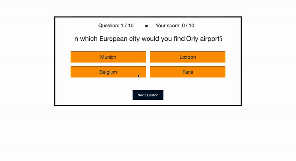

# TRIVIA-GAME

A simple browser-based game of trivia.



Assumptions:

- Each game round has 10 questions
- All questions are multiple-choice with 4 (or less) answer options

Features:

- User can view questions
- Questions + its answer options are displayed one at a time
- Questions are randomized using a custom `shuffle` function and do not repeat in a single round
- Correct + incorrect answers are also shuffled for each question
- User can select only ONE answer option out of 4 (or less) possible answers
- The edge case where less than 4 answers options are available is handled
- The correct answer is revealed if the user's selected answer is incorrect
- User's score is tracked throughout the game and is updated when a new question is revealed
- User can see their final score at the end of the round
- User can choose to play another round when the game is finished

### Technologies used

HTML/CSS, Javscript, lite-server package, Jest for testing [TODO]

### How to run

From within the project directory, run in terminal:

```bash
npm install
npm run dev
```

### TODOs

- [ ] refactoring
- [x] proper JSON fetching
- [ ] unit tests
- [ ] CSS/HTML clean-up
